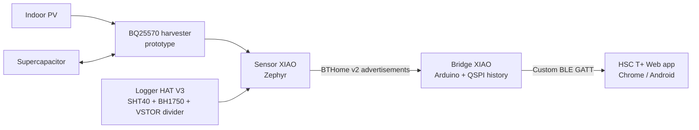

# HSC T+ Firmware

Open firmware and hardware documentation for an energy-aware Bluetooth Low
Energy environmental monitor built around two Seeed Studio XIAO nRF52840
boards.

- The **sensor** wakes every 20 seconds, measures its available channels, and
  broadcasts one second of non-connectable BTHome v2 advertisements.
- The **bridge** remains on USB power, continuously receives those broadcasts,
  stores up to 4,096 samples in QSPI flash, and exposes live/history data over
  a custom BLE GATT service.
- The **web app** is maintained separately at
  [brianc-5/HSC-IoT_Temp](https://github.com/brianc-5/HSC-IoT_Temp). It connects
  to the bridge with Web Bluetooth; the sensor never connects to a phone.

The production sensor is written for Zephyr. The earlier Arduino bare-sensor
firmware is retained for reference and compatibility.

## Project status

The Zephyr sensor, bridge, bare-board mode, and Logger HAT V3 measurement path
have been exercised on hardware. The HAT's temperature, humidity, light, and
voltage-divider readings work. The HAT currently has an unresolved standby
power problem, so this repository does **not** claim a final ultra-low-power
HAT deployment. See [HAT power investigation](docs/HAT_POWER.md) before using
it with harvested energy.

There is also no endorsed stock BQ25570/CJMCU deployment configuration. The
harvester material is a reference design and validation checklist, not a
ready-to-copy electrical prescription.

## System at a glance

The bridge and sensor are different firmware images and are not
interchangeable. The bridge is intentionally always-on and USB-powered; the
sensor is designed to sleep and operate from constrained energy.

## Fastest start: flash released UF2 files

1. Download the sensor and bridge UF2 files from the
   [latest release](https://github.com/brianc-5/HSC-IoT_Temp-firmware/releases/latest).
2. Double-tap **Reset** on the sensor XIAO and copy
   `HSC-Tplus-sensor-zephyr.uf2` to the bootloader drive.
3. Double-tap **Reset** on the bridge XIAO and copy
   `HSC-Tplus-bridge-commissioning.uf2` to its bootloader drive.
4. Keep the bridge on USB and open its serial port at 115200 baud. Record the
   sensor address printed in a `[sample] sensor=...` line.
5. For normal use, create an address-locked bridge build by following
   [commissioning](docs/COMMISSIONING.md). The generic bridge UF2 accepts any
   compatible nearby HSC T+ sensor and is intended only for commissioning.
6. Open the separately hosted
   [HSC T+ web app](https://brianc-5.github.io/HSC-IoT_Temp/) in Chrome on
   Android and connect to `HSC T+ Bridge`.

Detailed direct-flashing and recovery steps are in
[docs/FLASHING.md](docs/FLASHING.md). Source builds are covered in
[docs/BUILDING.md](docs/BUILDING.md).

## Automatically detected sensor configurations

One Zephyr sensor image detects the fitted hardware and USB state.

| ID | Detected sensor state | Advertised measurements |
| ---: | --- | --- |
| 1 | Bare XIAO + USB | MCU die temperature and regulated VDD |
| 2 | Bare XIAO + external power | MCU die temperature and regulated VDD |
| 3 | Logger HAT V3 + USB | Ambient temperature, humidity, and light; voltage invalid |
| 4 | Logger HAT V3 + external power | Ambient temperature, humidity, light, and valid VSTOR when in range |

Default cadence is 20 seconds. Each new sample is advertised for one second at
200 ms intervals and 0 dBm. The cadence travels in every enhanced protocol
frame, so the bridge and web app do not need recompilation when it changes.

## Documentation

- [Architecture and role separation](docs/ARCHITECTURE.md)
- [Hardware, wiring, and HAT configuration](docs/HARDWARE.md)
- [Flash prebuilt UF2 files](docs/FLASHING.md)
- [Build all firmware from source](docs/BUILDING.md)
- [Commission and lock the bridge to a sensor](docs/COMMISSIONING.md)
- [Operate the complete system](docs/USAGE.md)
- [Logger HAT V3 power investigation](docs/HAT_POWER.md)
- [Energy harvesting reference](docs/ENERGY_HARVESTING.md)
- [BLE and binary protocol](docs/PROTOCOL.md)
- [Troubleshooting](docs/TROUBLESHOOTING.md)
- [Security and privacy](SECURITY.md)
- [Development and tests](docs/DEVELOPMENT.md)

## Source layout

| Path | Purpose |
| --- | --- |
| `sensor-zephyr/` | Production auto-detecting low-power sensor |
| `sensor-arduino/` | Legacy bare-sensor Arduino implementation |
| `bridge/` | USB bridge, scanner, persistent history, and GATT server |
| `tests/` | Deterministic host-side models for protocol and flash recovery |
| `docs/` | Architecture, hardware, flashing, operation, and development guides |
| `.github/workflows/` | Reproducible build, test, and release automation |

## Safety

Do not connect USB and an external 3.3 V source at the same time unless the
power paths are isolated in hardware. VBUS detection in firmware reports the
power state; it does not prevent electrical back-feed. Do not connect a solar
cell, supercapacitor, BQ25570 board, or unknown voltage-divider output until
you have measured its voltage, polarity, and current limits.

This is a development project, not a certified measurement, medical, safety,
or battery-management product.

## Credits and license

Designed and maintained by **Brian Chirio**. Logger HAT V3 hardware is
documented by the upstream
[XIAO-log project](https://github.com/potblitd/XIAO-log); it is referenced here
with attribution and is not vendored.

Project code and documentation are licensed under the
[Apache License 2.0](LICENSE).
