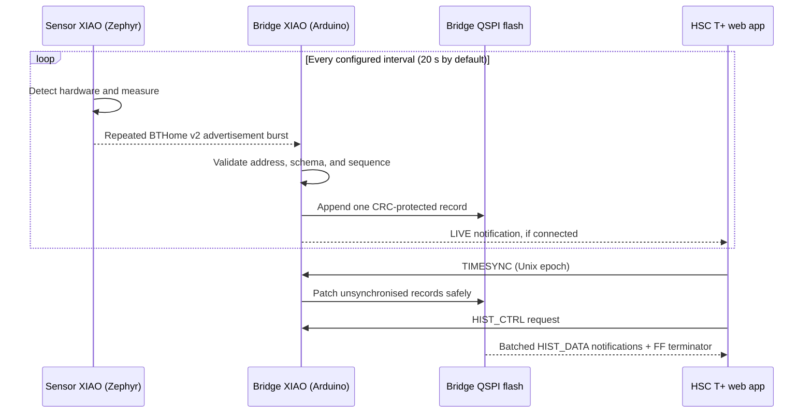

# Architecture

HSC T+ deliberately separates sensing, collection, and presentation. This
keeps the energy-limited node simple and lets the always-powered bridge absorb
the cost of continuous scanning, persistent storage, and phone connections.

## Data path

There is no BLE connection between sensor and bridge. The sensor broadcasts;
the bridge observes. There is no direct browser-to-sensor path.

## Sensor role

Target: Seeed Studio XIAO nRF52840.

The production Zephyr image:

- detects a Logger HAT V3 by performing a verified sensor transaction;
- detects USB VBUS in the nRF52840 POWER peripheral;
- chooses one of four configuration IDs without a mode switch;
- measures MCU die temperature/VDD in bare mode;
- measures SHT40 temperature/humidity, BH1750 illuminance, and optionally
  VSTOR through the HAT divider in HAT mode;
- emits unencrypted BTHome v2 service data for a one-second burst;
- then returns to System ON idle until the next sample.

The sensor has no GATT service, pairing flow, filesystem, network access, or
wall clock. A stable static-random BLE identity is derived by the controller
from device-specific hardware information and remains stable across resets.

## Bridge role

Target: a second Seeed Studio XIAO nRF52840, kept on USB power.

The Arduino/Bluefruit image performs two BLE roles at once:

- observer: passive 100% duty-cycle scanning for sensor advertisements;
- peripheral: connectable `HSC T+ Bridge` GATT server for the phone.

It validates BTHome fields, deduplicates the repeated packets in a burst,
extends the sensor's wrapping 8-bit packet ID, and stores a 16-byte record in
external QSPI flash. It retains 4,096 records and continues scanning while a
phone is connected or history is being transferred.

Flash records and time patches live in separate 256 KiB logs. Each slot has a
CRC and commit marker so boot recovery can ignore corrupt or torn writes. The
bridge can operate without a clock; when the web app supplies Unix time, it
maps uptime-based records to epochs and persists those patches.

## Web application role

The web app is intentionally outside this repository:

- source: <https://github.com/brianc-5/HSC-IoT_Temp>
- hosted application: <https://brianc-5.github.io/HSC-IoT_Temp/>

It is the user interface and the source of wall-clock time. It reads STATUS
before interpreting LIVE or history records, displays only fields valid for
the reported configuration, charts up to the bridge's retention limit, and
exports CSV. Its power calculations use timestamped VSTOR samples and a
user-entered storage capacitance; they are estimates of power delivered into
the storage node, not direct panel-terminal power.

## Why sensor and bridge firmware differ

| Concern | Sensor | Bridge |
| --- | --- | --- |
| Energy source | Harvested/external or USB during setup | Continuous USB |
| BLE behavior | Non-connectable broadcaster | Scanner + connectable peripheral |
| Active time | Short measurement/radio burst | Always active |
| Persistent data | None | 4,096-record QSPI history |
| Clock | Sample interval only | Uptime plus web-app time sync |
| User interface | None | GATT transport to separate web app |
| Recommended framework | Zephyr | Arduino/Bluefruit |

Flashing bridge firmware onto the sensor makes it continuously active and is
incompatible with an energy-harvesting power budget. Flashing sensor firmware
onto the bridge removes the phone-facing service and history.

## Protocol boundaries

Two versioned boundaries allow components to evolve independently:

1. Sensor-to-bridge: BTHome v2 Service Data UUID `0xFCD2`, enhanced frame
   revision 3.1, with compatibility for the original 11-byte form.
2. Bridge-to-web-app: custom service `8f0e0001-9d7d-4d5a-9f2b-3c4a5b6c7d8e`
   with fixed 16-byte Record v3 and STATUS v3 values.

See [PROTOCOL.md](PROTOCOL.md) before changing field order, sizes, sentinels,
UUIDs, or flash layout.

## Failure behavior

- A bad sensor field uses an explicit sentinel; it does not suppress the
  complete advertisement.
- One valid HAT sensor is enough to retain HAT mode. Three consecutive samples
  with no valid HAT field demote to bare mode; periodic rediscovery continues.
- A malformed or unsupported advertisement is rejected before storage.
- A repeated packet ID inside the cadence-aware duplicate window is ignored.
- Torn/corrupt flash slots are ignored during boot recovery.
- The bridge continues recording without a phone or time sync.
- The web app can reconnect and retrieve retained records later.
