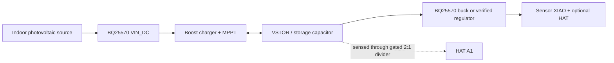

# Energy-harvesting reference

The intended deployment explores indoor photovoltaic energy, a BQ25570 energy
harvester, storage in a capacitor/supercapacitor, and a low-power XIAO sensor.
There is currently **no stock deployed configuration**. Board variants,
resistor populations, panel behavior, capacitor leakage, and sensor load must
be characterized before the design can be copied safely.

## Conceptual power path



The HAT's BAT+ divider is a measurement connection, not the sensor supply. The
exact CJMCU input, BAT/VSTOR, and output names must be traced on the actual
board.

## BQ25570 behavior relevant to bring-up

The BQ25570 is designed for very-low-power sources, with a boost charger,
periodic open-circuit-voltage sampling for MPPT, storage undervoltage and
overvoltage thresholds, and a buck output. Commonly quoted characteristics
include cold start around 600 mV/15 µW, operation from roughly 100 mV after
startup, and an MPPT sample approximately every 16 seconds. Those are IC-level
capabilities—not proof that a particular CJMCU module, panel, or load will
start and sustain this system.

Thresholds are programmed by resistors on the board. The BQ25570 storage
undervoltage threshold has a fixed internal floor near 1.95 V, while storage
overvoltage, battery-good thresholds, MPPT ratio, and buck output depend on the
implementation. A marketplace module's apparent 4.2 V overvoltage target must
be verified from components and measurement.

Use the official
[TI BQ25570 product page and datasheet](https://www.ti.com/product/BQ25570)
for absolute maximums, equations, startup conditions, and layout rules.

## Characterize an unknown CJMCU board

Before connecting a XIAO:

1. Photograph both sides and record all component markings and resistor values.
2. Trace continuity between connector labels and BQ25570 pins.
3. Identify VIN, ground, VSTOR/BAT, regulated output, enable, and battery-good
   signals; do not assume label meaning.
4. Apply a current-limited laboratory source that emulates the panel.
5. Measure cold-start voltage/power, VSTOR rise, programmed overvoltage clamp,
   buck output, and behavior when the source disappears.
6. Measure board quiescent current from storage with the output disabled and
   enabled.
7. Confirm polarity and maximum voltage against the selected storage device.
8. Add the actual sensor and capture rail droop during radio and HAT conversion
   peaks.

Only after those results are stable should the panel and long-term storage be
connected.

## Storage sizing

For an ideal capacitor:

```text
stored energy between Vhigh and Vlow = 0.5 × C × (Vhigh² − Vlow²)
```

Real usable energy is lower because of capacitor leakage, converter quiescent
current, conversion efficiency, ESR, voltage thresholds, self-discharge, and
the sensor's pulsed load. A nominal 1 F value in the web app is merely a UI
default. Enter the capacitance actually installed and treat tolerances and
voltage dependence explicitly.

At 20-second cadence, estimate sensor energy per cycle from a measured current
trace rather than multiplying a peak current by the full interval:

```text
cycle energy = integral(V(t) × I(t) dt)
average power = cycle energy / 20 s
```

Run the same integration in darkness to establish storage/converter/load loss,
then compare illuminated data. The web app's `C × V × dV/dt` result estimates
net energy entering the storage node. It does not directly measure panel power
and does not apply buck efficiency.

## Minimum validation set

- full dark discharge for long enough to estimate leakage and standby load;
- start from an empty/low storage state at the weakest intended light level;
- transition between dark and light without USB attached;
- hot/cold testing across expected capacitor and converter temperature;
- brownout and repeated cold-start recovery;
- radio/HAT peak droop at minimum operating storage voltage;
- storage overvoltage behavior at maximum illumination and minimum load;
- several days of unattended operation with raw VSTOR and lux retained;
- direct multimeter comparison for the 2:1 divider;
- test with the exact enclosure because panel angle and sensor self-heating
  affect results.

## Safety

Use a storage component rated above every possible fault and clamp voltage.
Observe capacitor polarity. Add current limiting during bring-up. Do not use an
unknown lithium-cell charging configuration. This repository's use of the word
“battery” in third-party board labels does not certify a circuit for any cell
chemistry.
